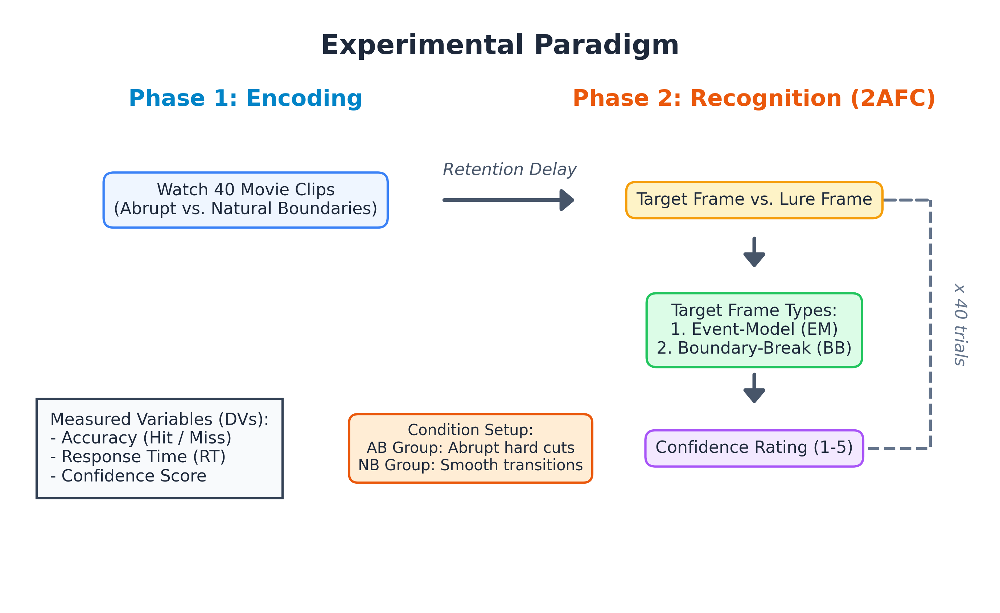

# Introduction (Archit)

## Background: Event Segmentation Theory

- Our brains **segment** continuous experience into discrete *events*
- Transitions = **event boundaries** (Zacks et al., 2007)
- Boundaries trigger an update of the internal *event model*
- Memory at event boundaries is encoded **differently** (Swallow et al., 2009)

\vspace{0.2cm}

Two types of boundaries:

- **Natural boundaries (NB):** Smooth, organic transitions
- **Abrupt boundaries (AB):** Sudden, artificially imposed transitions (hard cuts)

::: notes
Hello everyone. I am Archit, and I will introduce our study. Event Segmentation Theory, proposed by Zacks and colleagues in 2007, tells us that our brains automatically segment continuous experience into discrete events. The transitions between events, called event boundaries, trigger an update of our internal event model. This is a real-time mental representation of the current situation. This updating has consequences for memory: content near boundaries is encoded differently from mid-event content. There are two types of event boundaries. Natural boundaries are smooth, organic transitions. Abrupt boundaries are sudden, artificially imposed transitions like hard cuts in a film.
:::

## Task Paradigm

{width=85%}

::: notes
This figure shows our experimental paradigm. In the encoding phase, participants watched 40 short movie clips. One group saw clips with abrupt hard cuts at event boundaries, while the other group saw clips with smooth, natural transitions. After a delay, all participants completed a two-alternative forced-choice recognition test with 40 trials. On each trial, they saw a target frame and a perceptually similar lure, and had to identify which frame they had actually seen. They then rated their confidence on a 1 to 5 scale. Target frames were either Event-Model frames, consistent with the ongoing event, or Boundary-Break frames, drawn from near an event boundary. We measured three dependent variables: accuracy, response time, and confidence.
:::

## Design, Participants, and Demographics

- **2 $\times$ 2 mixed design:**
  - Boundary Type (AB vs. NB) -- **between-subjects**
  - Target Frame Type (EM vs. BB) -- **within-subjects**
- **170 participants** (81 AB, 89 NB); 1 excluded for missing data
- **Demographics:** Age $M$ = 22.2 ($SD$ = 2.0); 123 M, 47 F; 94 normal vision, 74 corrected
- Missing demographics (22/185) imputed: age $\rightarrow$ **median**, categoricals $\rightarrow$ **mode**
- **DVs:** Recognition accuracy, Response time, Confidence (1--5)

::: notes
We used a two-by-two mixed design. Boundary type was between-subjects and target frame type was within-subjects. We had 170 participants after excluding one for missing data. Demographic data came from an external survey. 22 participants had missing demographics, which we imputed using the median for age and the mode for categorical variables like gender and vision. The sample was mostly male, with a mean age of about 22 years.
:::

## Six Hypotheses

\small

| | Hypothesis | Prediction |
|:--|:-----------|:-----------|
| H1 | Boundary Type $\rightarrow$ Accuracy | NB > AB |
| H2 | Boundary Advantage | BB > EM (Radvansky \& Zacks, 2017) |
| H3 | Interaction $\rightarrow$ Accuracy | Condition $\times$ Target significant |
| H4 | RT Interaction | AB: BB slower than EM; NB: no difference |
| H5 | Signal Detection | NB higher $d'$ than AB |
| H6 | Demographics | Age, gender, vision moderate accuracy |

::: notes
We tested six hypotheses. H1 predicts NB outperforms AB. H2, based on the boundary advantage literature, predicts BB targets are recognized better than EM targets. H3 tests the accuracy interaction. H4 predicts an RT interaction where AB participants are slower for BB targets. H5 predicts NB has higher d-prime in signal detection. H6 tests whether demographics moderate performance. Now I will hand over to Bhavya.
:::

# Methods and Accuracy (Bhavya)

## Analytical Pipeline

- **171 PsychoPy CSV files** parsed in Python 3; **6,800 trials** final
- RT outliers removed: < 0.2 s or > 60 s (1 trial)

\vspace{0.15cm}

**Extended pipeline for each DV:**

1. Descriptive statistics (means, SDs)
2. **Normality check** (Shapiro-Wilk per cell, Levene's test)
3. 2 $\times$ 2 mixed ANOVA ($\eta_p^2$; follow-ups with Cohen's $d$)
4. Non-parametric robustness checks if normality violated
5. **Signal Detection Theory** ($d'$, criterion $c$; log-linear correction)
6. **Mixed-effects models** (crossed random effects: subjects $\times$ items)
7. **Demographic moderation** (ANCOVA, correlations)

::: notes
Hello, I am Bhavya. Our extended pipeline now includes seven steps for each DV. Beyond the original four steps of descriptives, normality, ANOVA, and non-parametric tests, we added Signal Detection Theory with d-prime and criterion c, mixed-effects models with crossed random effects for both subjects and items, and demographic moderation analyses.
:::

## H1, H2: Accuracy Results

\begin{columns}
\begin{column}{0.52\textwidth}
\textbf{H1 (NB > AB): Supported}
\begin{itemize}
  \item \textit{F}(1, 168) = 7.25, \textit{p} = .008, $\eta_p^2$ = .041
  \item NB (\textit{M} = .871) > AB (\textit{M} = .840), \textit{d} = 0.41
\end{itemize}
\vspace{0.15cm}
\textbf{H2 (BB > EM): Not Supported}
\begin{itemize}
  \item \textit{F}(1, 168) = 11.44, \textit{p} < .001, $\eta_p^2$ = .064
  \item But EM (\textit{M} = .870) > BB (\textit{M} = .843)
  \item Direction \textbf{opposite} to boundary advantage prediction
\end{itemize}
\vspace{0.15cm}
\textbf{H3 (Interaction): Not Supported}
\begin{itemize}
  \item \textit{F}(1, 168) = 0.21, \textit{p} = .651
\end{itemize}
\end{column}
\begin{column}{0.45\textwidth}
\includegraphics[width=\textwidth]{output/fig1_accuracy_barplot.png}
\end{column}
\end{columns}

::: notes
For accuracy, H1 was supported: NB outperformed AB with a medium effect size of 0.41. H2 was NOT supported: we predicted a boundary advantage with BB exceeding EM, but the data showed the opposite. EM targets were recognized significantly better than BB targets. This means the boundary advantage described by Radvansky and Zacks does not hold when boundaries are artificially disrupted. H3, the interaction, was not significant. Non-parametric tests confirmed all results.
:::

## H5: Signal Detection Theory

\begin{columns}
\begin{column}{0.48\textwidth}
\textbf{d' (Discriminability):}
\begin{itemize}
  \item NB d' = 2.26 > AB d' = 2.01
  \item \textit{t} = 2.55, \textit{p} = .012, \textit{d} = 0.39
  \item \textbf{H5 supported}
\end{itemize}
\vspace{0.15cm}
\textbf{Criterion c (Response Bias):}
\begin{itemize}
  \item No group difference (\textit{p} = .296)
  \item NB advantage is \textbf{genuine discriminability}
\end{itemize}
\vspace{0.15cm}
\textbf{ANOVA on d':}
\begin{itemize}
  \item Condition: \textit{F} = 6.48, \textit{p} = .012
  \item Target: \textit{F} = 8.20, \textit{p} = .005
\end{itemize}
\end{column}
\begin{column}{0.48\textwidth}
\includegraphics[width=\textwidth]{output/fig9_sdt_dprime.png}
\end{column}
\end{columns}

::: notes
Signal Detection Theory confirmed that the NB advantage reflects genuine discriminability. NB participants had d-prime of 2.26 compared to 2.01 for AB, a significant difference. Critically, response criterion c did not differ, ruling out response bias. The ANOVA on d-prime mirrored the accuracy ANOVA, confirming both condition and target type effects.
:::

## Mixed-Effects Models

\begin{columns}
\begin{column}{0.50\textwidth}
\textbf{Crossed random effects (subjects $\times$ items):}
\vspace{0.1cm}

\textbf{Accuracy:}
\begin{itemize}
  \item Condition: \textit{b} = .036, \textit{z} = 2.95, \textit{p} = .003
  \item Target: \textit{b} = .031, \textit{z} = 2.51, \textit{p} = .012
  \item Interaction: n.s. (\textit{p} = .669)
\end{itemize}
\vspace{0.1cm}
\textbf{Confidence:}
\begin{itemize}
  \item Condition: \textit{b} = .161, \textit{z} = 6.89, \textit{p} < .001
  \item Target: \textit{b} = .091, \textit{z} = 2.89, \textit{p} = .004
\end{itemize}
\vspace{0.1cm}
$\Rightarrow$ Results robust to item-level variability
\end{column}
\begin{column}{0.47\textwidth}
\includegraphics[width=\textwidth]{output/fig12_mixed_effects_forest.png}
\end{column}
\end{columns}

::: notes
We fitted mixed-effects models with crossed random intercepts for subjects and items to account for the fact that some movies may be inherently easier or harder. The results confirmed our ANOVA findings. The condition effect on accuracy was b equals 0.036, significant at p equals point-zero-zero-three. The target type effect was also significant. Item-level variance was captured, validating this approach.
:::

# RT, Confidence, Demographics, and Conclusion (Hrishiraj)

## H4: RT Interaction

\begin{columns}
\begin{column}{0.50\textwidth}
\textbf{Omnibus:} \textit{F}(1, 168) = 3.36, \textit{p} = .069

\vspace{0.15cm}
\textbf{Simple effects:}
\begin{itemize}
  \item AB: EM (5.45 s) vs BB (5.66 s)
  \item \textit{t} = --2.56, \textit{p} = .012, \textit{d} = --0.15
  \item NB: EM vs BB -- n.s. (\textit{p} = .673)
\end{itemize}
\vspace{0.15cm}
\textbf{Bayesian analysis:}
\begin{itemize}
  \item BF$_{10}$ = 0.78 (anecdotal for H0)
  \item Suggestive but inconclusive
\end{itemize}
\vspace{0.1cm}
$\Rightarrow$ \textbf{H4 partially supported}
\end{column}
\begin{column}{0.47\textwidth}
\includegraphics[width=\textwidth]{output/fig10_rt_interaction.png}
\end{column}
\end{columns}

::: notes
Hello, I am Hrishiraj. The RT interaction was marginally significant at p equals point-zero-six-nine. But simple effects were clear: within the AB group, BB targets were responded to significantly slower than EM targets, while the NB group showed no difference. A Bayesian analysis yielded a Bayes Factor of 0.78, providing anecdotal evidence for the null. So H4 is partially supported — the pattern is there but needs replication.
:::

## Confidence Interaction and Dissociation

\begin{columns}
\begin{column}{0.50\textwidth}
\textbf{Confidence ANOVA:}
\begin{itemize}
  \item Target Type: \textit{p} = .018, $\eta_p^2$ = .033
  \item \textbf{Interaction: \textit{p} = .046, $\eta_p^2$ = .023}
\end{itemize}
\vspace{0.1cm}
\textbf{Simple effects:}
\begin{itemize}
  \item AB: EM > BB (\textit{p} = .003)
  \item NB: EM $\approx$ BB (\textit{p} = .733)
  \item BB: NB > AB (\textit{p} = .024)
\end{itemize}
\vspace{0.1cm}
\textbf{Key insight:}

Abrupt boundaries impair \textbf{metacognitive certainty} for BB targets without proportionally reducing accuracy.
\end{column}
\begin{column}{0.47\textwidth}
\includegraphics[width=\textwidth]{output/fig7_confidence_interaction.png}
\end{column}
\end{columns}

::: notes
The confidence analysis revealed our most striking finding. The interaction was significant: within the AB group, participants were significantly less confident about BB targets compared to EM targets. But the NB group showed no confidence difference at all. This dissociation between accuracy and confidence means abrupt boundaries selectively impair metacognitive certainty for boundary-adjacent content.
:::

## H6: Demographic Moderation

\begin{columns}
\begin{column}{0.55\textwidth}
\textbf{Age:} Negative correlation with accuracy

$\rho$ = --0.203, \textit{p} = .008

\vspace{0.15cm}
\textbf{Gender:} Marginal female advantage

Females (\textit{M} = .875) vs Males (\textit{M} = .849), \textit{p} = .053

\vspace{0.15cm}
\textbf{Vision:} No effect (\textit{p} = .749)

\vspace{0.15cm}
\textbf{ANCOVA:} Condition effect \textbf{survives} covariate adjustment

\textit{F} = 8.38, \textit{p} = .004, $\eta_p^2$ = .048

\vspace{0.1cm}
$\Rightarrow$ \textbf{H6 partially supported} (age effect)
\end{column}
\begin{column}{0.42\textwidth}
\includegraphics[width=\textwidth]{output/fig11_demographics.png}
\end{column}
\end{columns}

::: notes
For demographic moderation, age was significantly negatively correlated with accuracy, even in this narrow young-adult range. Females showed a marginal advantage. Vision correction had no effect. Importantly, the ANCOVA showed that the condition effect on accuracy survives after controlling for all demographics, confirming the robustness of our main finding.
:::

## Summary of Results

\small

| Hypothesis | Prediction | Result | Support |
|:-----------|:-----------|:-------|:-------:|
| H1 (Boundary $\rightarrow$ Acc) | NB > AB | NB > AB, $d$ = 0.41 | **Yes** |
| H2 (Boundary advantage) | BB > EM | EM > BB (reversed) | **No** |
| H3 (Acc Interaction) | Significant | $p$ = .651 | **No** |
| H4 (RT Interaction) | AB: BB slower | AB: $p$ = .012; NB: n.s. | **Partial** |
| H5 (SDT $d'$) | NB > AB | NB > AB, $d$ = 0.39 | **Yes** |
| H6 (Demographics) | Moderation | Age: $p$ = .008 | **Partial** |

\vspace{0.15cm}

All primary conclusions robust to non-parametric testing and mixed-effects modelling.

::: notes
Here is the summary. H1 and H5 were fully supported: natural boundaries preserve memory. H2, the boundary advantage, was rejected: EM targets were actually better, not BB. H4 was partially supported with clear simple effects but a marginal omnibus test. H6 showed age effects but no moderation of the main finding.
:::

## Conclusion and Future Directions

**Key findings:**

1. Natural boundaries facilitate encoding (accuracy *and* $d'$)
2. Boundary advantage fails when boundaries are artificially disrupted
3. Abrupt cuts impair metacognitive certainty (confidence interaction)
4. Results robust across ANOVA, SDT, mixed-effects, and non-parametric tests

\vspace{0.2cm}

**Future directions:**

- Yes/no recognition paradigm for richer SDT analysis
- Model item-level predictors (boundary salience, lure similarity)
- Replicate RT interaction with larger sample
- Within-subjects boundary manipulation

::: notes
In conclusion, natural event boundaries facilitate both memory encoding and signal detection. The boundary advantage does not hold when boundaries are artificially disrupted. And abrupt cuts create a unique dissociation between accuracy and confidence. These findings were confirmed across multiple analytical methods. Future work should use a yes-no paradigm for SDT, model item predictors, and replicate the RT interaction.
:::

## Thank You

\centering

**Team Odomos**

\vspace{0.3cm}

Archit Choudhary | Bhavya Ahuja | Hrishiraj Mitra

\vspace{0.5cm}

**Questions?**

::: notes
Thank you for your attention. We are happy to take any questions.
:::

## References

\small

- Boltz, M. (1992). Temporal accent structure and the remembering of filmed narratives. *JEPHPP*, *18*(1), 90--105.
- Hautus, M. J. (1995). Corrections for extreme proportions. *BRMIC*, *27*(1), 46--51.
- Radvansky, G. A., \& Zacks, J. M. (2017). Event boundaries in memory and cognition. *COBS*, *17*, 133--140.
- Swallow, K. M., Zacks, J. M., \& Abrams, R. A. (2009). Event boundaries affect memory encoding. *JEP:G*, *138*(2), 236--257.
- Zacks, J. M., et al. (2007). Event perception: A mind--brain perspective. *Psych. Bull.*, *133*(2), 273--293.

::: notes
These are our references.
:::
