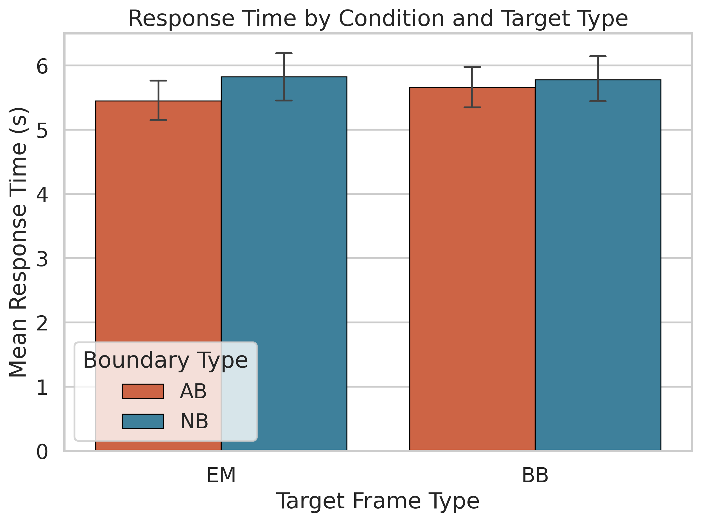

# Introduction

## Background

When we watch a movie, our brain automatically segments the incoming stream of information into discrete units called *events*. The transitions between these units, known as **event boundaries**, play a critical role in how we encode and retrieve information from memory. Event Segmentation Theory (Zacks, Speer, Swallow, Braver, & Reynolds, 2007) proposes that event boundaries trigger an update of the observer's internal *event model*, a real-time mental representation of the situation. This updating mechanism has consequences for memory: information at or near event boundaries is processed and stored differently than mid-event content (Swallow, Zacks, & Abrams, 2009).

A key distinction exists between **natural boundaries** (smooth, organic transitions between activities) and **abrupt boundaries** (sudden or artificially imposed transitions such as hard cuts). Whether boundary type differentially influences memory is both theoretically relevant and practically important for film editing, educational video design, and media communication (Zacks & Swallow, 2007).

## The Present Experiment

This experiment investigated how **boundary type** (Abrupt vs. Natural; between-subjects) and **target frame type** (Event-Model match vs. Boundary-Break; within-subjects) affect recognition memory for frames from short movie clips. Participants watched 40 movie clips and then completed a two-alternative forced-choice recognition test, identifying which of two frames (one target, one perceptually similar lure) they had actually seen. Target frames were either **Event-Model (EM)** frames, consistent with the ongoing event representation, or **Boundary-Break (BB)** frames, drawn from near an event boundary. Three DVs were measured: recognition accuracy, response time, and subjective confidence (1–5 scale). The dataset consists of 171 individual PsychoPy output files collected across multiple sessions.

## Hypotheses

Based on Event Segmentation Theory, we tested the following hypotheses across all three DVs:

- **H1 (Boundary Type main effect):** NB participants will show better recognition performance than AB participants, because natural event segmentation supports more coherent encoding.
- **H2 (Target Type main effect):** EM targets will be recognized more accurately and confidently than BB targets, because EM frames are consistent with the maintained event representation.
- **H3 (Interaction):** The EM-BB gap may be larger in the AB group, as abrupt boundaries may differentially impair encoding of boundary-adjacent content.

# Methods

## Participants and Design

Of 171 tested participants, one (sub42) was excluded due to missing recognition data, yielding **170 participants** (81 AB, 89 NB). No participants fell below the 55% accuracy threshold (chance level). The experiment used a 2 (Boundary Type: AB vs. NB; between) $\times$ 2 (Target Type: EM vs. BB; within) mixed design, with 40 recognition trials per participant (20 EM, 20 BB).

## Data Processing

Individual PsychoPy CSV files were parsed in Python 3 to extract accuracy (0/1), RT (seconds), and confidence (1–5) for each recognition trial. Target type was classified from image filenames. RT values below 0.2 s or above 60 s were treated as outliers (1 trial affected). Per-subject means were computed for each DV in each cell of the design.

## Statistical Analysis

For each DV, the analysis followed a systematic pipeline aligned with our hypotheses: (1) descriptive statistics, (2) normality assessment via Shapiro-Wilk tests on per-cell distributions and Levene's test for variance homogeneity, (3) a 2 $\times$ 2 mixed ANOVA (using `pingouin`) with partial eta-squared ($\eta_p^2$) as effect size, and (4) if normality was violated, non-parametric robustness checks (Mann-Whitney U for between-subjects effects, Wilcoxon signed-rank for within-subjects effects, Mann-Whitney on difference scores for the interaction). Significant main effects were followed up with *t*-tests (Cohen's *d*); significant interactions with simple effects analyses. Spearman correlations were computed between DVs. All *p*-values are exact and uncorrected, with $\alpha$ = .05.

# Results

## Overview

The final dataset contained **6,800 trials** from 170 participants. Table 1 summarizes means and standard deviations. Each DV subsection below follows the pipeline: descriptive pattern, normality check, parametric ANOVA, and non-parametric robustness checks where normality was violated.

**Table 1.** Descriptive statistics (*M* $\pm$ *SD*) by Condition and Target Type.

| Condition | Target | *N* | Accuracy | RT (s) | Confidence |
|:---------:|:------:|:---:|:--------:|:------:|:----------:|
| AB | EM | 81 | .855 $\pm$ .092 | 5.45 $\pm$ 1.38 | 4.13 $\pm$ 0.46 |
| AB | BB | 81 | .824 $\pm$ .105 | 5.66 $\pm$ 1.50 | 4.04 $\pm$ 0.49 |
| NB | EM | 89 | .883 $\pm$ .079 | 5.83 $\pm$ 1.85 | 4.21 $\pm$ 0.44 |
| NB | BB | 89 | .860 $\pm$ .096 | 5.78 $\pm$ 1.64 | 4.20 $\pm$ 0.42 |

## Recognition Accuracy (H1, H2, H3)

**Descriptive pattern.** Accuracy was high (82–88%), well above chance. The NB group had numerically higher accuracy (*M* = .871) than the AB group (*M* = .840), consistent with H1. EM targets (*M* = .870) were recognized better than BB targets (*M* = .843), consistent with H2.

**Normality check.** Shapiro-Wilk tests indicated normality was violated in all four cells (all *p* < .002). Levene's test confirmed homogeneity of variance (*p* > .08). QQ plots (see supplementary `output/fig5_qq_plots.png`) showed mild left-skew. Because normality was violated, non-parametric tests are reported alongside the parametric ANOVA.

{width=48%}

**Parametric.** There was a significant main effect of Boundary Type, *F*(1, 168) = 7.247, *p* = .0078, $\eta_p^2$ = .041: the NB group (*M* = .871) outperformed the AB group (*M* = .840), *t* = −2.692, *p* = .0078, *d* = −0.413. There was a significant main effect of Target Type, *F*(1, 168) = 11.438, *p* = .0009, $\eta_p^2$ = .064: EM targets (*M* = .870) were recognized better than BB targets (*M* = .843), *t* = 3.390, *p* = .0009, *d* = 0.287. The interaction was not significant, *F*(1, 168) = 0.206, *p* = .6506, $\eta_p^2$ = .001.

**Non-parametric.** Mann-Whitney confirmed the Boundary Type effect (*U* = 2744.0, *p* = .0070, *r* = −0.239) and Wilcoxon confirmed the Target Type effect (*W* = 3134.5, *p* = .0029, *r* = 0.296). The interaction remained non-significant (*U* = 3643.5, *p* = .9036).

## Response Time (H1, H2, H3)

**Descriptive pattern.** RT ranged from 5.45 to 5.83 s across cells with small differences.

**Normality check.** Normality was violated in all four cells (all *p* < .002). Levene's test confirmed variance homogeneity (*p* > .08).

{width=48%}

No significant effects were found. Boundary Type: *F*(1, 168) = 1.101, *p* = .2955. Target Type: *F*(1, 168) = 1.158, *p* = .2835. The interaction approached significance, *F*(1, 168) = 3.358, *p* = .0686, $\eta_p^2$ = .020. Non-parametric tests converged: Boundary Type (*U* = 3324.0, *p* = .3823), Target Type (*W* = 6206.0, *p* = .0988), Interaction (*U* = 3218.0, *p* = .2285).

## Confidence Ratings (H1, H2, H3)

**Descriptive pattern.** Confidence was high (4.04--4.21). The NB group was numerically more confident, and EM targets received slightly higher confidence.

**Normality check.** Three cells met normality; NB $\times$ EM was non-normal (*W* = 0.956, *p* = .004). Variance homogeneity held (*p* > .08).

**Parametric.** Boundary Type was not significant, *F*(1, 168) = 3.243, *p* = .0735. Target Type was significant, *F*(1, 168) = 5.696, *p* = .0181, $\eta_p^2$ = .033: EM targets (*M* = 4.17) received higher confidence than BB targets (*M* = 4.12), *t* = 2.366, *p* = .0191, *d* = 0.105. The interaction was significant, *F*(1, 168) = 4.026, *p* = .0464, $\eta_p^2$ = .023.

Simple effects: within the AB group, confidence was higher for EM than BB (*t* = 3.098, *p* = .0027, *d* = 0.191); within the NB group, no difference (*t* = 0.342, *p* = .7331). For BB targets, NB participants were more confident than AB participants (*t* = −2.285, *p* = .0236, *d* = −0.351); for EM targets, no difference (*p* = .2509).

{width=48%}

**Non-parametric.** Wilcoxon confirmed Target Type (*W* = 4990.5, *p* = .0251, *r* = 0.205). The interaction was also significant (*U* = 4323.0, *p* = .0250, *r* = 0.199). Simple effects replicated the pattern: EM-BB significant in AB (*W* = 831.5, *p* = .0017) but not NB (*W* = 1713.0, *p* = .8934); BB confidence differed between conditions (*U* = 2901.0, *p* = .0282) while EM did not (*U* = 3223.5, *p* = .2348).

## Correlations Between DVs

Spearman correlations revealed that accuracy and confidence were positively correlated ($\rho$ = 0.360, *p* < .0001), indicating reasonable metacognitive calibration. RT and confidence were weakly negatively correlated ($\rho$ = −0.152, *p* = .0474). Accuracy and RT were not correlated ($\rho$ = −0.054, *p* = .4868), indicating no speed-accuracy tradeoff.

# Conclusion

## Summary

This preliminary analysis yielded three key findings. First, **H1 was supported for accuracy**: the NB group had significantly higher accuracy than the AB group (*d* = 0.41), suggesting that natural event segmentation supports better encoding. Second, **H2 was supported**: EM targets were recognized more accurately (*d* = 0.29) and with higher confidence (*d* = 0.11), consistent with EST. Third, **H3 was supported for confidence but not accuracy**: while accuracy showed no interaction, confidence showed a significant Boundary Type $\times$ Target Type interaction. The AB group was less confident about BB targets but showed normal confidence for EM targets, whereas the NB group was equally confident regardless of target type. This dissociation suggests that abrupt boundaries selectively impair metacognitive certainty for boundary-adjacent content. All conclusions were robust to non-parametric testing.

## Limitations and Future Directions

Demographic information was not captured, precluding individual difference analyses. Item-level variability was not modelled; mixed-effects models with crossed random effects could address this. Signal Detection Theory measures (*d'*, criterion *c*) would add nuance. The near-significant RT interaction (*p* = .069) warrants follow-up.

# References

Swallow, K. M., Zacks, J. M., & Abrams, R. A. (2009). Event boundaries in perception affect memory encoding and updating. *Journal of Experimental Psychology: General*, *138*(2), 236–257. https://doi.org/10.1037/a0015631

Zacks, J. M., & Swallow, K. M. (2007). Event segmentation. *Current Directions in Psychological Science*, *16*(2), 80–84. https://doi.org/10.1111/j.1467-8721.2007.00480.x

Zacks, J. M., Speer, N. K., Swallow, K. M., Braver, T. S., & Reynolds, J. R. (2007). Event perception: A mind–brain perspective. *Psychological Bulletin*, *133*(2), 273–293. https://doi.org/10.1037/0033-2909.133.2.273

# Contribution

All team members contributed equally to this report.

| Member | Contribution |
|:-------|:-------------|
| Archit Choudhary (2023114002) | Data extraction, statistical analysis, assumption testing |
| Bhavya Ahuja (2023111035) | Literature review, introduction and methods writing |
| Hrishiraj Mitra (2023111037) | Visualization, report formatting, conclusions |

---

*Github Repository:* https://github.com/firearc7/odomos-brsm
