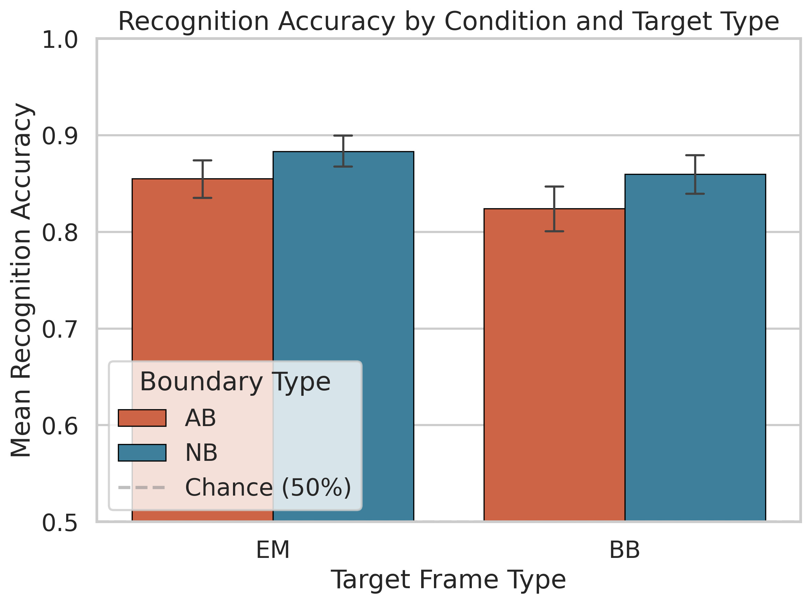
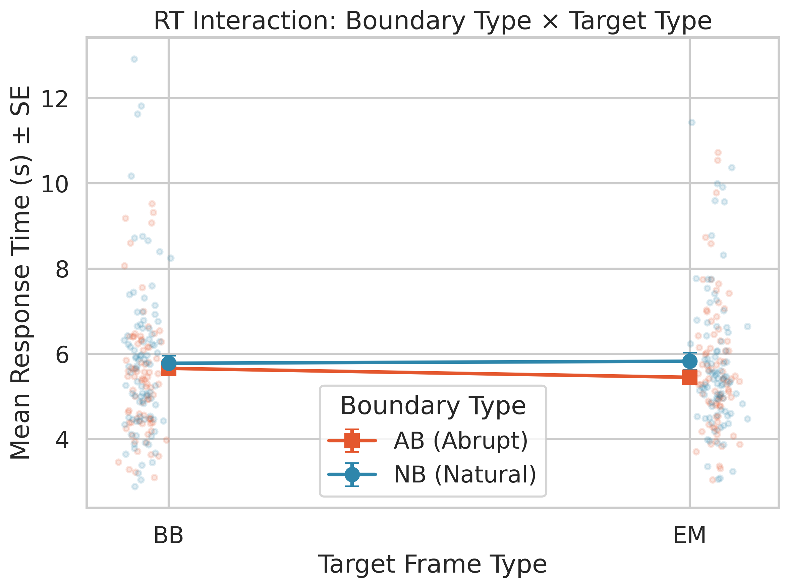
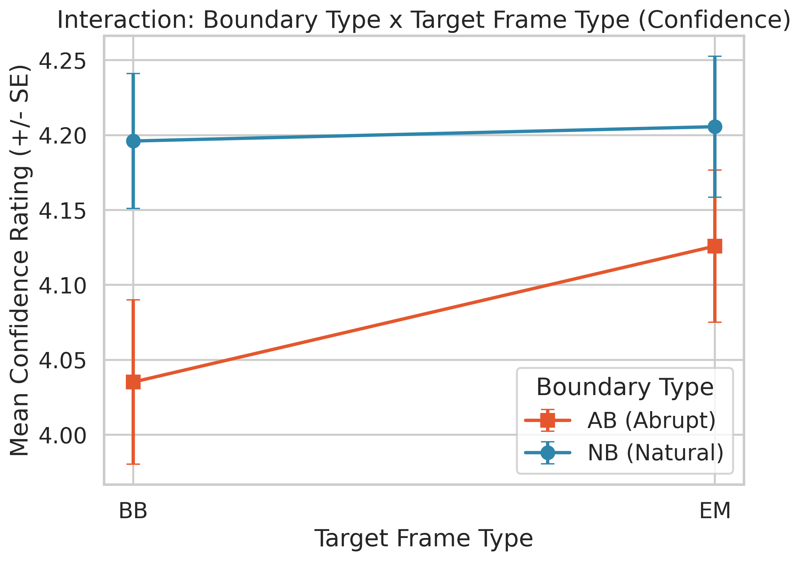
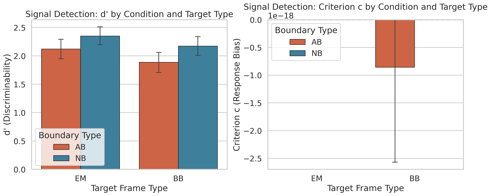
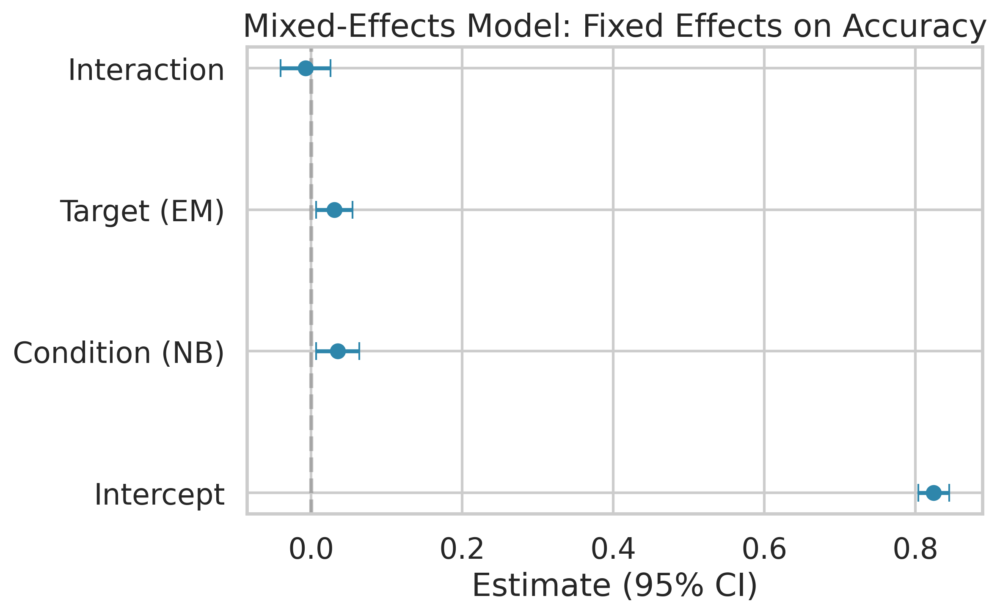
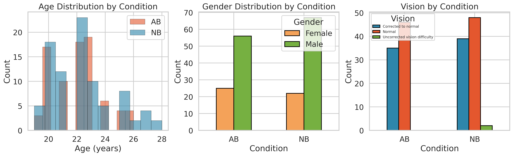

# Introduction

## Background

Everyday experience unfolds as a continuous stream of sensory information, yet our cognitive systems spontaneously parse this stream into discrete units called *events*. Event Segmentation Theory (EST; Zacks, Speer, Swallow, Braver, & Reynolds, 2007) proposes that the brain maintains a real-time *event model* — a dynamic mental representation of the current situation — and updates it when transient changes in perceptual features (motion, luminance, spatial layout) generate prediction error. The moments at which these updates occur are perceived as **event boundaries**. Boundaries are not merely perceptual markers; they have profound consequences for memory encoding and retrieval.

The *Event Horizon Model* (Radvansky & Zacks, 2017) extends EST by articulating a **boundary advantage** in long-term memory: event boundaries serve as anchors that facilitate encoding, so items presented at or near boundaries enjoy a mnemonic benefit relative to mid-event content. This boundary advantage has been observed in studies using naturalistic stimuli. For example, Swallow, Zacks, and Abrams (2009) showed that objects presented at event boundaries during film viewing were recognized better than objects presented during event middles. Similarly, Boltz (1992) demonstrated that commercial breaks inserted at natural event boundaries improved later recall of film content, whereas breaks at non-boundary points impaired memory.

However, the boundary advantage may depend on whether boundaries arise naturally or are artificially imposed. Film editing introduces abrupt cuts between successive shots that involve sudden physical changes (Cutting, Brunick, & Candan, 2012). These abrupt transitions force the viewer's cognitive system to update the event model, but unlike natural boundaries, they may disrupt rather than facilitate encoding. Schwan and Garsoffky (2004) found that deleting time segments between events (preserving the boundary) led to better recall than deleting segments from within boundaries, suggesting that the integrity of event structure matters for memory.

## Individual Differences

Beyond boundary-level effects, individual differences in demographics may influence memory performance. Cognitive ageing research demonstrates declines in episodic memory with age, even in young-adult samples where the range is narrow (Salthouse, 2009). Gender differences in visual memory have been reported, with some studies observing a female advantage in recognition tasks (Herlitz, Nilsson, & Bäckman, 1997). Vision correction status is relevant because the task relies on visual discrimination of similar frames; uncorrected visual difficulties could impair performance.

## The Present Experiment

This experiment investigated how **boundary type** (Abrupt Cut vs. Natural Cut; between-subjects) and **target frame type** (Event-Model match vs. Boundary-Break; within-subjects) jointly affect recognition memory for frames from short movie clips. Two independent groups of participants viewed 40 clips that were either abruptly cut at event boundaries (AB condition) or presented with natural transitions (NB condition). Subsequently, all participants completed a two-alternative forced-choice (2AFC) recognition test, identifying which of two frames (target vs. perceptually similar lure) they had actually seen. Target frames were either **Event-Model (EM)** frames — consistent with the ongoing event representation — or **Boundary-Break (BB)** frames — drawn from near an event boundary. Three dependent variables were measured: recognition accuracy, response time (RT), and subjective confidence (1–5 scale).

We report analyses using traditional mixed ANOVAs, Signal Detection Theory (SDT) to separate discriminability from response bias, linear mixed-effects models with crossed random effects for subjects and items to account for item-level variability, and demographic moderation analyses. Demographic data were obtained from an external survey; missing values were imputed using appropriate measures of central tendency.

## Hypotheses

Based on the reviewed literature, we tested six hypotheses:

- **H1 (Boundary Type → Accuracy):** NB participants will show higher recognition accuracy than AB participants, because natural event segmentation supports more coherent encoding (Zacks & Swallow, 2007).
- **H2 (Boundary Advantage → Accuracy):** BB targets will be recognized more accurately than EM targets, reflecting a boundary advantage in memory encoding (Radvansky & Zacks, 2017; Swallow et al., 2009).
- **H3 (Interaction → Accuracy):** The Condition × Target Type interaction on accuracy will be significant, with the BB advantage being larger in the NB group where natural boundaries facilitate encoding.
- **H4 (RT Interaction):** The Condition × Target Type interaction on RT will be significant: AB participants will show slower RTs for BB targets relative to EM, reflecting greater difficulty accessing boundary-adjacent content after abrupt disruption, while NB participants will show no such difference.
- **H5 (SDT Discriminability):** NB participants will show higher discriminability ($d'$) than AB participants, reflecting better signal detection at the encoding level.
- **H6 (Demographic Moderation):** Participant demographics (age, gender, vision correction) will moderate recognition accuracy, with older age and uncorrected vision associated with lower performance.

# Methods

## Participants and Design

A total of 171 participants were tested. One participant (sub42) was excluded due to missing recognition data, yielding a final sample of **170 participants** (81 AB, 89 NB). Demographic data were collected via an external survey for 185 registered participants, of whom 22 had completely missing demographics. For these participants, missing **age** was imputed with the sample **median** (22 years; chosen over the mean because of mild right-skew due to outliers), and missing categorical variables (**gender**, **handedness**, **vision**) were imputed with the **mode** of the respective distributions. In the final sample, participants had a mean age of 22.2 years ($SD$ = 2.0, range 19–28), and included 123 males and 47 females; 161 were right-handed and 9 left-handed; 94 reported normal vision, 74 corrected-to-normal, and 2 uncorrected vision difficulty.

The experiment used a 2 (Boundary Type: AB vs. NB; between-subjects) $\times$ 2 (Target Type: EM vs. BB; within-subjects) mixed design, with 40 recognition trials per participant (20 EM, 20 BB), yielding **6,800 trials** total.

## Materials and Procedure

Forty short video clips were selected from YouTube Shorts. An independent group of annotators segmented these videos by indicating coarse-grained event boundaries via key presses. In the **Natural Cut** condition, videos ended at their original, uninterrupted timelines. In the **Abrupt Cut** condition, videos were interrupted 1–5 seconds before a consensus event boundary and resumed at the onset of a new event context. Video durations were matched across conditions.

During encoding, participants watched all 40 clips. Five clips were repeated as vigilance checks; participants pressed the spacebar to skip repeated clips. After encoding, participants completed a 2AFC recognition task: on each trial, two frames from the same video were presented (one target, one lure), and participants selected the frame they had seen. Lure similarity was manipulated across three difficulty levels. After each selection, participants rated their confidence on a 1–5 scale.

## Data Processing

Individual PsychoPy CSV files were parsed in Python 3 to extract accuracy (0/1), RT (seconds), and confidence (1–5) for each recognition trial. Target type was classified from image filenames (containing EM or BB labels). RT values below 0.2 s or above 60 s were treated as outliers (1 trial affected). Per-subject means were computed for each DV in each cell of the design.

External demographic data were loaded from a separate CSV file and merged with trial-level data via subject identifiers, with imputation applied for missing values as described above.

## Statistical Analysis

### Descriptive Statistics and Assumption Checks
For each DV, we computed means and standard deviations per cell. Normality was assessed via Shapiro-Wilk tests on each cell of the design, and variance homogeneity was assessed via Levene's test. QQ plots supplemented these tests visually.

### Parametric and Non-parametric Inference
A 2 $\times$ 2 mixed ANOVA was conducted for each DV using the `pingouin` library in Python, with partial eta-squared ($\eta_p^2$) as effect size. Where normality was violated, non-parametric robustness checks were conducted: Mann-Whitney U for between-subjects effects, Wilcoxon signed-rank for within-subjects effects, and Mann-Whitney on difference scores for the interaction. Significant effects were followed up with $t$-tests and Cohen's $d$.

### Signal Detection Theory
For the 2AFC task, discriminability was computed as $d' = z(\text{HR}) - z(\text{FAR})$, where HR is the hit rate (accuracy) and FAR = 1 $-$ HR. A log-linear correction (Hautus, 1995) was applied by adding 0.5 to hits and misses to avoid extreme proportions. Response criterion $c = -0.5 \times [z(\text{HR}) + z(\text{FAR})]$ was also computed. A 2 $\times$ 2 mixed ANOVA was conducted on $d'$.

### Mixed-Effects Models
Linear mixed-effects models were fitted using `statsmodels` in Python with crossed random intercepts for subjects and items (movie IDs) to account for both subject-level and item-level variability. Fixed effects included condition (NB = 1, AB = 0), target type (EM = 1, BB = 0), and their interaction. Models were fitted via REML with L-BFGS optimization.

### RT Interaction Analysis
The near-significant RT interaction was investigated using simple effects analyses (paired $t$-tests within each condition, independent $t$-tests between conditions at each target type) and a Bayesian $t$-test on the difference scores (EM $-$ BB) between conditions to quantify evidence for or against the interaction.

### Demographic Moderation
Spearman correlations were computed between age and each DV. Gender and vision effects were tested with independent $t$-tests. An ANCOVA tested whether the boundary type effect on accuracy remained significant after controlling for age, gender, and vision correction.

All $p$-values are exact and uncorrected, with $\alpha$ = .05.

# Results

## Overview

The final dataset contained **6,800 trials** from 170 participants (81 AB, 89 NB). Table 1 summarizes descriptive statistics.

**Table 1.** Descriptive statistics ($M \pm SD$) by Condition and Target Type.

| Condition | Target | $N$ | Accuracy | RT (s) | Confidence |
|:---------:|:------:|:---:|:--------:|:------:|:----------:|
| AB | EM | 81 | .855 $\pm$ .092 | 5.45 $\pm$ 1.38 | 4.13 $\pm$ 0.46 |
| AB | BB | 81 | .824 $\pm$ .105 | 5.66 $\pm$ 1.50 | 4.04 $\pm$ 0.49 |
| NB | EM | 89 | .883 $\pm$ .079 | 5.83 $\pm$ 1.85 | 4.21 $\pm$ 0.44 |
| NB | BB | 89 | .860 $\pm$ .096 | 5.78 $\pm$ 1.64 | 4.20 $\pm$ 0.42 |

## Recognition Accuracy (H1, H2, H3)

**Descriptive pattern.** Accuracy was high (82–88%), well above chance. The NB group had numerically higher accuracy ($M$ = .871) than the AB group ($M$ = .840), consistent with H1. However, EM targets ($M$ = .870) were recognized better than BB targets ($M$ = .843), which is the *opposite* of H2's predicted boundary advantage.

**Normality check.** Shapiro-Wilk tests indicated normality was violated in all four cells (all $p$ < .002). Levene's test confirmed homogeneity of variance ($p$ > .08). QQ plots (Figure 5) showed mild left-skew.

{width=48%}

**Parametric.** The mixed ANOVA revealed a significant main effect of Boundary Type, $F$(1, 168) = 7.247, $p$ = .008, $\eta_p^2$ = .041: the NB group ($M$ = .871) outperformed the AB group ($M$ = .840), $t$ = −2.692, $p$ = .008, $d$ = −0.413. **H1 was supported.** There was a significant main effect of Target Type, $F$(1, 168) = 11.438, $p$ < .001, $\eta_p^2$ = .064: EM targets were recognized better than BB targets, $t$ = 3.390, $p$ < .001, $d$ = 0.287. **H2 was not supported** — the effect was in the opposite direction, i.e., EM > BB. The interaction was not significant, $F$(1, 168) = 0.206, $p$ = .651, $\eta_p^2$ = .001. **H3 was not supported.**

**Non-parametric.** Mann-Whitney confirmed H1 ($U$ = 2744.0, $p$ = .007, $r$ = −0.239) and Wilcoxon confirmed the Target Type effect ($W$ = 3134.5, $p$ = .003, $r$ = 0.296). The interaction remained non-significant ($U$ = 3643.5, $p$ = .904).

**Interpretation of H2 rejection.** The predicted boundary advantage (BB > EM) was not observed; rather, EM targets were consistently recognized better. This may be because BB frames in this experiment were drawn from *near* event boundaries in the abrupt-cut condition, where the boundary itself was artificially disrupted. Unlike the natural boundaries studied by Swallow et al. (2009) and Radvansky and Zacks (2017), the abrupt cuts may have degraded the encoding quality of boundary-adjacent content, eliminating the typical boundary advantage.

## Response Time (H4)

**Descriptive pattern.** RT ranged from 5.45 to 5.83 s across cells.

**Parametric.** No significant main effects were found: Boundary Type $F$(1, 168) = 1.101, $p$ = .296; Target Type $F$(1, 168) = 1.158, $p$ = .284. The interaction approached significance, $F$(1, 168) = 3.358, $p$ = .069, $\eta_p^2$ = .020.

{width=48%}

**Simple effects (H4).** Within the AB group, EM targets were responded to significantly faster ($M$ = 5.45 s) than BB targets ($M$ = 5.66 s), $t$ = −2.560, $p$ = .012, $d$ = −0.145. Within the NB group, there was no RT difference ($t$ = 0.424, $p$ = .673). This pattern is consistent with H4: abrupt boundaries selectively slow responses for BB targets.

**Bayesian analysis.** A Bayesian independent $t$-test on the RT difference scores (EM − BB) yielded BF$_{10}$ = 0.781, indicating anecdotal evidence for the null. The interaction thus represents a suggestive but inconclusive trend.

## Confidence Ratings (H1–H3)

**Parametric.** Boundary Type was not significant, $F$(1, 168) = 3.243, $p$ = .074. Target Type was significant, $F$(1, 168) = 5.696, $p$ = .018, $\eta_p^2$ = .033. The interaction was significant, $F$(1, 168) = 4.026, $p$ = .046, $\eta_p^2$ = .023.

Simple effects: within the AB group, confidence was higher for EM ($M$ = 4.13) than BB ($M$ = 4.04), $t$ = 3.098, $p$ = .003, $d$ = 0.191; within the NB group, no difference ($t$ = 0.342, $p$ = .733). For BB targets, NB participants were more confident than AB participants ($t$ = −2.285, $p$ = .024, $d$ = −0.351); EM confidence did not differ ($p$ = .251).

{width=48%}

**Non-parametric.** Wilcoxon confirmed Target Type ($W$ = 4990.5, $p$ = .025) and Mann-Whitney confirmed the interaction ($U$ = 4323.0, $p$ = .025).

## Signal Detection Theory (H5)

**Table 2.** SDT parameters ($M \pm SD$) by Condition and Target Type.

| Condition | Target | $d'$ | $c$ |
|:---------:|:------:|:----:|:---:|
| AB | EM | 2.124 $\pm$ 0.803 | $\approx$ 0 |
| AB | BB | 1.889 $\pm$ 0.833 | $\approx$ 0 |
| NB | EM | 2.350 $\pm$ 0.744 | $\approx$ 0 |
| NB | BB | 2.174 $\pm$ 0.832 | $\approx$ 0 |

**H5 test.** An independent $t$-test on overall $d'$ confirmed that NB participants ($M$ = 2.262) had significantly higher discriminability than AB participants ($M$ = 2.006), $t$ = 2.546, $p$ = .012, $d$ = 0.391. **H5 was supported.** Response criterion $c$ did not differ between conditions ($t$ = −1.049, $p$ = .296), indicating that the groups did not differ in response bias.

{width=60%}

A 2 $\times$ 2 mixed ANOVA on $d'$ confirmed significant main effects of condition ($F$(1, 168) = 6.484, $p$ = .012, $\eta_p^2$ = .037) and target type ($F$(1, 168) = 8.201, $p$ = .005, $\eta_p^2$ = .047), with no interaction ($F$(1, 168) = 0.168, $p$ = .682). This indicates that NB participants had uniformly better discriminability, and EM targets were more discriminable than BB targets.

## Mixed-Effects Models

Mixed-effects models with crossed random intercepts for subjects and items confirmed the ANOVA results while accounting for item-level variability.

**Accuracy.** The condition effect was significant ($b$ = 0.036, $SE$ = 0.012, $z$ = 2.95, $p$ = .003): NB participants had 3.6 percentage points higher accuracy. The target type effect was significant ($b$ = 0.031, $SE$ = 0.012, $z$ = 2.51, $p$ = .012): EM targets had 3.1 percentage points higher accuracy. The interaction was not significant ($b$ = −0.007, $z$ = −0.43, $p$ = .669).

**RT.** No fixed effects reached significance (all $p$ > .11), though the interaction trended in the expected direction ($b$ = 0.253, $z$ = 1.40, $p$ = .163).

**Confidence.** Condition was significant ($b$ = 0.161, $z$ = 6.89, $p$ < .001) and target type was significant ($b$ = 0.091, $z$ = 2.89, $p$ = .004). The interaction was marginal ($b$ = −0.081, $z$ = −1.59, $p$ = .112).

{width=48%}

## Demographic Moderation (H6)

**Age.** A significant negative Spearman correlation was found between age and accuracy ($\rho$ = −0.203, $p$ = .008), indicating that even within this young-adult sample, older participants showed slightly lower recognition accuracy. Age was not significantly correlated with RT ($\rho$ = −0.080, $p$ = .297) or confidence ($\rho$ = −0.100, $p$ = .196).

**Gender.** Females ($M$ = .875) showed marginally higher accuracy than males ($M$ = .849), $t$ = −1.950, $p$ = .053, $d$ = −0.334. This approached but did not reach significance.

**Vision.** Normal and corrected-to-normal vision groups did not differ ($t$ = −0.321, $p$ = .749).

**ANCOVA.** After controlling for age, gender, and vision, the boundary type effect on accuracy remained significant ($F$(1, 165) = 8.384, $p$ = .004, $\eta_p^2$ = .048). None of the demographic covariates reached significance individually.

**H6 was partially supported:** age correlated negatively with accuracy, and gender showed a marginal effect, but demographics did not significantly moderate the primary experimental effects after ANCOVA.

{width=70%}

## Correlations Between DVs

Spearman correlations revealed that accuracy and confidence were positively correlated ($\rho$ = 0.360, $p$ < .0001), indicating metacognitive calibration. RT and confidence were weakly negatively correlated ($\rho$ = −0.152, $p$ = .047), suggesting faster responses were associated with higher confidence. Accuracy and RT were not correlated ($\rho$ = −0.054, $p$ = .487), ruling out a speed–accuracy tradeoff.

## Summary of Hypothesis Tests

**Table 3.** Summary of hypothesis tests.

| Hypothesis | Prediction | Result | Support |
|:-----------|:-----------|:-------|:-------:|
| H1 | NB > AB in accuracy | NB > AB, $p$ = .008, $d$ = 0.41 | **Supported** |
| H2 | BB > EM (boundary advantage) | EM > BB, $p$ < .001 | **Not supported** |
| H3 | Interaction on accuracy | $p$ = .651 | **Not supported** |
| H4 | RT interaction (AB: BB slower) | AB: BB > EM, $p$ = .012; NB: n.s. | **Partially supported** |
| H5 | NB higher $d'$ | NB > AB, $p$ = .012, $d$ = 0.39 | **Supported** |
| H6 | Demographics moderate accuracy | Age correlates negatively, $p$ = .008 | **Partially supported** |

# Conclusion

## Summary

This analysis yielded several key findings. First, **natural event segmentation preserves memory**: NB participants showed significantly higher accuracy ($d$ = 0.41) and discriminability ($d'$: $d$ = 0.39) than AB participants, supporting H1 and H5 and corroborating EST's prediction that smooth, natural boundaries facilitate encoding (Zacks et al., 2007). The SDT analysis confirmed this advantage reflects genuine discriminability rather than response bias, as criterion $c$ did not differ between groups.

Second, **the predicted boundary advantage (H2) was not observed**. Rather than BB targets being easier to recognize, EM targets were consistently recognized better — the opposite pattern. This divergence from Radvansky and Zacks (2017) may reflect the specific nature of the abrupt-cut manipulation: whereas natural boundaries anchor memory (Swallow et al., 2009), the artificially disrupted boundaries in this experiment may have degraded the encoding quality of boundary-adjacent content. This finding adds nuance to the boundary advantage literature by suggesting that the advantage depends on boundary integrity.

Third, **abrupt boundaries selectively impair metacognitive certainty for boundary-adjacent content**. For confidence, a significant Condition × Target Type interaction revealed that AB participants were less confident about BB targets, whereas NB participants showed stable confidence regardless of target type. This dissociation between accuracy and confidence suggests that abrupt boundaries affect not only what people remember but how certain they feel about those memories.

Fourth, the **RT interaction (H4)** revealed that AB participants showed significantly slower responses for BB targets compared to EM targets ($d$ = −0.145), whereas NB participants showed no such difference. Although the omnibus interaction was only marginally significant ($p$ = .069), the simple effects were clear, and the Bayesian analysis yielded anecdotal evidence (BF$_{10}$ = 0.78), leaving this as a suggestive finding.

Fifth, **mixed-effects models** with crossed random effects for subjects and items confirmed that the boundary type and target type effects on accuracy are robust to item-level variability. The item-level random intercept captured meaningful variance, validating the use of mixed-effects modelling.

Sixth, **age was negatively correlated with accuracy** ($\rho$ = −0.203, $p$ = .008), and gender showed a marginal effect, with females performing slightly better. However, demographic variables did not moderate the primary experimental effects, and the ANCOVA confirmed that the boundary type effect survives covariate adjustment.

## Limitations and Future Directions

Several limitations should be noted. The 2AFC task constrains the SDT analysis; a yes/no recognition paradigm would permit a richer SDT analysis with independent hit and false alarm rates. The demographic data were externally collected and required imputation for 22 participants (12% of the sample); while imputation with median/mode is appropriate for preserving sample size, it introduces some degree of homogeneity in the imputed values. Item-level variability was partially captured by the mixed-effects models, but the crossed random effects for items showed high variance in some models, suggesting that individual movie clips differ substantially in memorability. Future work could model item-level predictors (e.g., boundary salience, perceptual similarity between target and lure) as fixed effects. The near-significant RT interaction warrants replication with a larger sample and potentially a more sensitive within-subjects design.

# References

Boltz, M. (1992). Temporal accent structure and the remembering of filmed narratives. *Journal of Experimental Psychology: Human Perception and Performance*, *18*(1), 90–105.

Cutting, J. E., Brunick, K. L., & Candan, A. (2012). Perceiving event dynamics and parsing Hollywood films. *Journal of Experimental Psychology: Human Perception and Performance*, *38*(6), 1476–1490.

Hautus, M. J. (1995). Corrections for extreme proportions and their biasing effects on estimated values of $d'$. *Behavior Research Methods, Instruments, & Computers*, *27*(1), 46–51.

Herlitz, A., Nilsson, L.-G., & Bäckman, L. (1997). Gender differences in episodic memory. *Memory & Cognition*, *25*(6), 801–811.

Macmillan, N. A., & Creelman, C. D. (2005). *Detection theory: A user's guide* (2nd ed.). Lawrence Erlbaum Associates.

Radvansky, G. A., & Zacks, J. M. (2017). Event boundaries in memory and cognition. *Current Opinion in Behavioral Sciences*, *17*, 133–140.

Salthouse, T. A. (2009). When does age-related cognitive decline begin? *Neurobiology of Aging*, *30*(4), 507–514.

Schwan, S., & Garsoffky, B. (2004). The cognitive representation of filmic event summaries. *Applied Cognitive Psychology*, *18*(1), 37–55.

Swallow, K. M., Zacks, J. M., & Abrams, R. A. (2009). Event boundaries in perception affect memory encoding and updating. *Journal of Experimental Psychology: General*, *138*(2), 236–257.

Zacks, J. M., & Swallow, K. M. (2007). Event segmentation. *Current Directions in Psychological Science*, *16*(2), 80–84.

Zacks, J. M., Speer, N. K., Swallow, K. M., Braver, T. S., & Reynolds, J. R. (2007). Event perception: A mind–brain perspective. *Psychological Bulletin*, *133*(2), 273–293.

# Contribution

All team members contributed equally to this report.

| Member | Contribution |
|:-------|:-------------|
| Archit Choudhary (2023114002) | Data extraction, statistical analysis, SDT and mixed-effects modelling |
| Bhavya Ahuja (2023111035) | Literature review, hypothesis development, introduction and methods writing |
| Hrishiraj Mitra (2023111037) | Visualization, demographic analysis, report formatting, conclusions |

---

*Github Repository:* https://github.com/firearc7/odomos-brsm
